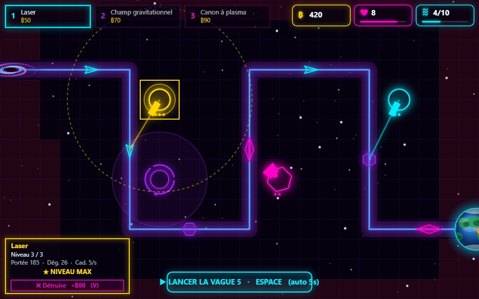

# NÉODRIVE — Défense Orbitale

Tower defense spatial **synthwave**, jouable directement dans le navigateur.
HTML5 Canvas + JavaScript vanilla (modules ES6) — **aucune dépendance, aucun build**.



## 🎮 Jouer en ligne

👉 **https://krbone14.github.io/neodrive/**

## Principe

Défends la Terre : les vaisseaux ennemis jaillissent d'un trou noir et suivent
la trajectoire orbitale jusqu'à la planète. Pose des tourelles pour les détruire,
survis aux **10 vagues** et abats le boss final, **Le Dreadnought**.

## Commandes

| Action | Commande |
|---|---|
| Choisir une tourelle | `1` Laser · `2` Champ gravitationnel · `3` Canon à plasma (ou clic sur le sélecteur) |
| Poser une tourelle | Clic sur une case libre |
| Sélectionner une tourelle posée | Clic dessus |
| Améliorer (niv. 1 → 3) | Bouton **▲ Améliorer** ou touche `A` |
| Détruire (rembourse 50 %) | Bouton **✖ Détruire** ou touche `V` |
| Lancer la vague | Bouton du bas ou `Espace` |
| Rejouer | Bouton **▶ Rejouer** ou touche `R` |

## Tourelles

- **Laser** — dégâts directs, cadence rapide
- **Champ gravitationnel** — ralentit les ennemis dans sa zone
- **Canon à plasma** — dégâts de zone

Chaque tourelle a 3 niveaux : néon coloré → **dorée** au niveau maximum.

## Attention au Dreadnought

Le boss de la vague 10 possède un bouclier régénérant (à briser avant la coque),
est immunisé au ralentissement et fait apparaître des éclaireurs. **S'il atteint
la planète, c'est game over instantané.**

## Lancer en local

Les modules ES6 imposent un serveur HTTP (le double-clic `file://` ne marche pas) :

```bash
npx http-server -p 8777
```

Puis ouvre `http://127.0.0.1:8777`.
